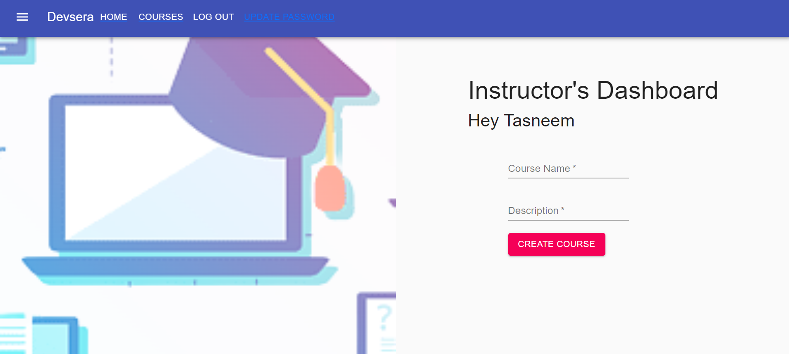

# Devsera
*A web application providing a healthy enviournment for anyone to learn full stack development for free.*

### Tech Stacks used
- React JS and Firebase.

### List of Contents                          
- **About**                           
- **Why Devsera**                  
- **Demonstration**                   
- **Architecture and Implementation** 
- **How to clone the repository**     

### About
- Devsera is an online platform for beginners to learn web development in a *healthy way*.
- Inspired by communities like Geek for Geeks and Stack Overflow, Devsera is a free to use platform for students providing courses for free. Students can sign up for as many courses as they wish to. 
- Instructors can register and upload their courses with videos in a structured format supported with  quizes. If the instructor wishes to gain monitory benifit they can share their youtube links in the place of videos. 
- Each course is supported by a forum where student who wish to interact and clear their doubts are welcomed and each course sub-section has a quiz for students to test their knowledge.

### Why Devsera?
- We strongly believe that education should be a free resource for everyone.
- Promoting community based development and learning is the right way to learn and move ahead for any developer.

### Demonstration

##### Instructor Login
- The instructors need to sign up first and then can login.

- Dashboard

##### Creating a course

- The add topic button helps to add a topic and create quiz button helps to create a quiz for the course.

##### Student Login
- The student need to sign up first and then can login.

- Student Dashboard

- The student can navigate to the courses page and the courses.

- Students can engage in discussions and answer queries in the Forum section

- Quiz to assist students grasp a better understanding of what they learned

### How to clone the repository
The frontend branch contains all the updates codes. Just clone that branch.

repository link :- https://github.com/prithvirohira8/Codestorm

### Project Contributors

[Prithvi Rohira](https://github.com/prithvirohira8)

[Varun Bhangre](https://github.com/varuunnn )

[Vedant Kangde](https://github.com/Vedantkangde)

[Bharat Rathi](https://github.com/Bharatrathi27412)
